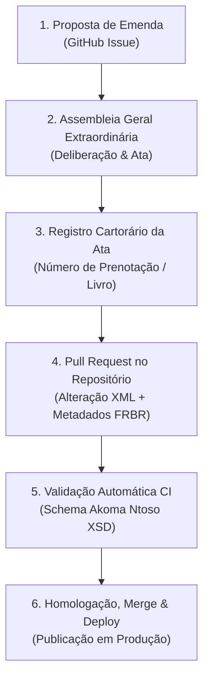

# Manual Institucional: Governança Digital de Emendas Estatutárias via Git

> **Organização:** Igreja Batista Nacional da Paz de Guapó (IBNP Guapó)  
> **Referência Normativa:** Estatuto Social da IBNP Guapó (Art. 18 e disposições de reforma estatutária)  
> **Padrão Tecnológico:** OASIS LegalDocML Akoma Ntoso 3.0 & Git Version Control  
> **Destinatários:** Diretoria Executiva, Conselho Fiscal, Presbitério e Membresia em Assembleia  

---

## 1. Princípios da Governança Aberta e Imutável

A **Igreja Batista Nacional da Paz de Guapó** adota uma política de vanguarda em transparência administrativa e governança eclesiástica. Seus documentos constitutivos e normativos — com destaque para o **Estatuto Social** e o **Regimento Interno** — são modelados no padrão internacional aberto **Akoma Ntoso 3.0 (OASIS LegalDocML)** e versionados publicamente por meio do sistema **Git**.

### Benefícios para a Comunidade Eclesiástica:
1. **Rastreabilidade e Integridade:** Cada alteração, inclusão ou revogação de artigo possui data, autor, justificativa e histórico auditável inalterável.
2. **Conformidade Notarial:** O versionamento do código reflete fielmente as atas registradas em Cartório de Registro de Títulos e Documentos de Pessoas Jurídicas.
3. **Imutabilidade:** Nenhuma alteração entra em vigor sem seguir o rito estatutário e a validação automatizada dos esquemas canônicos.
4. **Acesso Público Universal:** Qualquer membro ou cidadão pode consultar o texto em vigor ou auditar as versões históricas a qualquer momento.

---

## 2. Ciclo de Vida de uma Emenda Estatutária

O fluxo institucional e técnico para aprovação e publicação de emendas divide-se em 5 etapas:



---

### Etapa 1: Abertura da Proposta (GitHub Issue)
- **Quem propõe:** Diretoria Executiva, Pastor Presidente ou 1/5 dos membros em pleno gozo de seus direitos estatutários.
- **Canal:** Abertura de uma Issue no repositório `ibnp-guapo/website` com o título:  
  `[Proposta de Emenda] Descrição suscinta da alteração`.
- **Conteúdo Obrigatório:**
  - Artigo(s), parágrafo(s) ou inciso(s) afetados;
  - Texto atual versus nova redação proposta;
  - Justificativa eclesiástica e fundamentação doutrinária/administrativa.

---

### Etapa 2: Convocação e Aprovação em Assembleia Geral Extraordinária (AGE)
- A Assembleia Geral Extraordinária é convocada na forma estatutária, respeitando quóruns de convocação e instalação.
- O plenário debate e vota o projeto de emenda.
- A decisão é lavrada em **Ata Oficial**, assinada pela mesa diretora e pelos presentes.

---

### Etapa 3: Registro em Cartório
- A ata contendo a reforma estatutária é protocolada e registrada no competente Cartório de Registro Civil de Pessoas Jurídicas de Guapó - GO.
- Obtém-se o número de registro, livro, folha e data da averbação.

---

### Etapa 4: Formalização Técnica (Pull Request)
Um membro da equipe técnica ou secretário responsável cria uma branch e abre um **Pull Request (PR)**:

#### 1. Edição do XML Canônico:
Arquivo: `data/legal/estatuto-social.akn.xml`
- Localizar o elemento correspondente (ex: `<article eId="art_18">`) e alterar a redação aprovada.

#### 2. Atualização dos Metadados FRBR (Work, Expression, Manifestation):
No cabeçalho `<meta>` do XML, registrar os metadados da nova expressão:
```xml
<FRBRExpression>
    <FRBRthis value="/akn/br/act/estatuto/ibnp-guapo/2026-09-14/por@2026-09-14/main"/>
    <FRBRuri value="/akn/br/act/estatuto/ibnp-guapo/2026-09-14/por@2026-09-14"/>
    <FRBRdate date="2026-09-14" name="dataEmenda"/>
    <FRBRauthor href="#assembleiaGeral" as="#legislador"/>
    <FRBRlanguage language="por"/>
</FRBRExpression>
```

#### 3. Registro do Histórico na Seção `<lifecycle>`:
Adicionar o evento na linha do tempo do documento:
```xml
<lifecycle source="#ibnpGuapo">
    <eventRef date="2026-09-14" id="e2" source="#ataAge2026" type="amendment"/>
</lifecycle>
```

---

### Etapa 5: Validação Automatizada (CI)
Ao submeter o Pull Request, a esteira de Integração Contínua (**GitHub Actions**) é disparada automaticamente:
1. **Validação do Schema OASIS Akoma Ntoso 3.0:** Garante que a estrutura XML não violou regras sintáticas ou hierárquicas.
2. **Integridade de `eId`:** Verifica se todos os artigos e seções possuem identificadores semânticos únicos.
3. **Testes Unitários e de Integração:** Garante que o leitor e as rotas HTTP continuam funcionando perfeitamente.
4. **Regra de Bloqueio:** Nenhum código ou emenda com erro de validação pode ser incorporado à branch `main`.

---

### Etapa 6: Homologação, Merge e Publicação
- Após revisão do relator do conselho e aprovação do CI verde, o PR recebe o merge na branch `main`.
- O script de deploy em produção atualiza instantaneamente o leitor web em `https://lightcyan-kudu-279003.hostingersite.com/estatuto`.
- O commit gerado se torna a certidão pública digital da alteração estatutária.

---

## 3. Matriz de Responsabilidades (RACI)

| Atividade | Diretoria Executiva | Assembleia Geral | Equipe Técnica / Git | Conselho Fiscal |
|---|:---:|:---:|:---:|:---:|
| Elaborar Proposta de Emenda | **R / A** | **C** | **C** | **I** |
| Deliberar e Votar na AGE | **C** | **R / A** | **I** | **C** |
| Lavrar e Registrar Ata em Cartório | **R / A** | **I** | **I** | **I** |
| Abrir Pull Request e Atualizar XML | **C** | **I** | **R / A** | **I** |
| Validar Conformidade CI e Aprovar Merge | **A** | **I** | **R** | **I** |
| Auditar e Acompanhar Versões Públicas | **I** | **C** | **I** | **R / A** |

*Legenda: **R** = Responsável pela Execução, **A** = Aprovador / Autoridade, **C** = Consultado, **I** = Informado.*

---

## 4. Auditoria Pública e Transparência

Qualquer interessado pode validar o histórico de decisões e versões através de:
- **Repositório Oficial:** [https://github.com/ibnp-guapo/website](https://github.com/ibnp-guapo/website)
- **Histórico de Commits de Atos Legais:** `https://github.com/ibnp-guapo/website/commits/main/data/legal/estatuto-social.akn.xml`
- **Download do XML Original Assinado:** `GET /estatuto/xml` diretamente no portal oficial.
