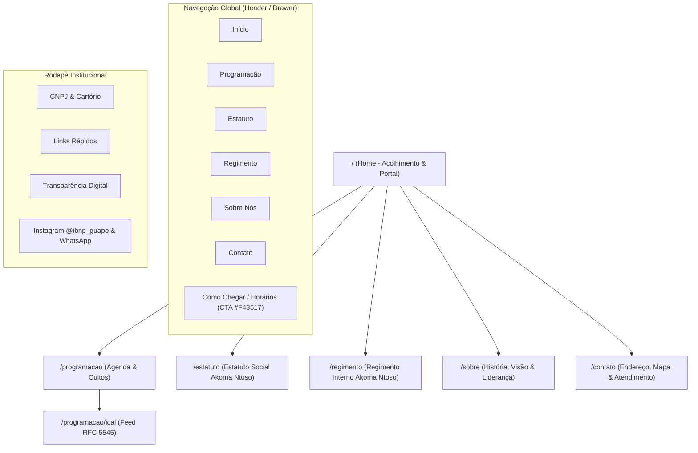

# [WDLC-F1] Especificação Técnica: Arquitetura de Informação, Mapa do Site e Requisitos do Portal

> **Identificador:** SPEC-WDLC-F1  
> **Status:** Aprovado  
> **Referência GitHub:** [Issue #1](https://github.com/ibnp-guapo/website/issues/1)  
> **Organização:** [ibnp-guapo](https://github.com/ibnp-guapo) / [website](https://github.com/ibnp-guapo/website)  
> **Última Atualização:** 2026-09-10  

---

## 1. Visão Geral & Contexto Institucional

A **Igreja Batista Nacional da Paz de Guapó** (comumente denominada **IBN da Paz de Guapó** ou **IBNP Guapó**), inscrita no CNPJ sob o nº `02.930.019/0001-62`, fundada em 14 de janeiro de 1999 e filiada à Convenção Batista Nacional (CBN / CBN Goiás), estabelece seu portal web oficial voltado a três pilares:

1. **Acolhimento Comunitário:** Ponto de contato amigável, acolhedor e informativo para visitantes, famílias e moradores do município de Guapó-GO e região metropolitana.
2. **Vida Congregacional & Programação:** Agenda dos encontros e cultos regulares semanais (quartas e domingos) com exportação direta para agendas móveis (.ics).
3. **Governança & Transparência Digital:** Publicação integral e transparente de seus atos constitutivos (Estatuto Social e Regimento Interno) sob o padrão internacional aberto **OASIS LegalDocML Akoma Ntoso 3.0**, permitindo consulta pública sem necessidade de cadastro ou login.

---

## 2. Personas & Jornadas de Usuário

| Persona | Perfil & Contexto | Necessidade Primária | Rota de Entrada | Critério de Sucesso |
| :--- | :--- | :--- | :--- | :--- |
| **Visitante de Primeira Vez em Guapó** | Morador ou recém-chegado à cidade procurando uma igreja bíblica e acolhedora. Acessa quase sempre via smartphone. | Localizar endereço físico, horário dos cultos de domingo e quarta, e saber como chegar. | `/` (Home) ou `/contato` | Obter horário e rota em menos de 10 segundos; botão de WhatsApp ou rota no Google Maps com 1 toque. |
| **Membro da Congregação** | Membro ativo da IBN da Paz que quer acompanhar a programação semanal e sincronizar no celular. | Consultar a escala de cultos da semana e adicionar ao calendário do celular. | `/programacao` | Baixar `.ics` com 1 clique e adicionar ao Google/Apple Calendar sem atrito. |
| **Liderança / Conselho Eclesiástico** | Pastor, diácono, conselheiro fiscal ou advogado da igreja consultando normas em reuniões deliberativas. | Acessar dispositivo exato do Estatuto Social ou Regimento Interno vigente com certeza jurídica. | `/estatuto` ou `/regimento` | Localizar artigo específico via busca textual ou sumário, com link compartilhável permanente (`#art_12`). |
| **Cidadão / Órgão Público / Cartório** | Cidadão de Guapó, cartório de registro civil ou entidade parceira auditando a conformidade institucional. | Verificar legitimidade, diretoria, CNPJ, dados de cartório e integridade do Estatuto. | `/sobre` ou `/estatuto` | Consulta imediata e download do XML semântico Akoma Ntoso 3.0 / PDF oficial sem restrições. |

---

## 3. Arquitetura de Informação & Mapa do Site (Sitemap)



### 3.1 Especificação Detalhada das Rotas HTTP

#### Rota 1: `/` (Homepage)
- **Título SEO:** `IBN da Paz de Guapó`
- **Meta Description:** `Seja bem-vindo à IBN da Paz de Guapó. Um lugar de comunhão, adoração e amor em Guapó-GO. Conheça nossos cultos de quarta e domingo, localização e histórico.`
- **Blocos de Conteúdo:**
  1. *Header Institucional:* Logo da igreja, navegação responsiva e botão de ação em destaque (`#F43517`).
  2. *Hero Section:* Mensagem acolhedora de boas-vindas (*"Um lugar de paz, comunhão e adoração a Deus em Guapó"*), com botões de chamada rápida para *"Ver Cultos da Semana"* e *"Como Chegar"*.
  3. *Widget "Cultos da Semana":* Apresentação clara dos cultos regulares (Quarta 19:30 e Domingo 19:30) com badges indicativos de transmissão ao vivo (`#F43517`).
  4. *Governança & Transparência:* Bloco em destaque convidando para leitura aberta do Estatuto Social e do Regimento Interno (destaque do padrão Akoma Ntoso 3.0).
  5. *Localização em Guapó:* Resumo do endereço no Centro de Guapó, mapa integrado, horários e botão de contato via WhatsApp.
  6. *Rodapé Completo:* Dados institucionais, links rápidos, redes sociais e direitos autorais.

#### Rota 2: `/programacao` (Agenda de Cultos e Eventos)
- **Título SEO:** `Programação e Cultos Semanais - IBN da Paz de Guapó`
- **Meta Description:** `Confira a escala de cultos da IBN da Paz de Guapó: Domingo da Celebração (19:30) e Quarta do Ensino e Oração (19:30). Sincronize em seu calendário.`
- **Blocos de Conteúdo:**
  1. *Header de Programação:* Título, introdução pastoral e botão destacado *"Adicionar ao Calendário (.ics)"*.
  2. *Abas / Alternador:* "Cultos Regulares" e "Eventos Especiais".
  3. *Grade de Cultos Regulares (Apenas Quarta e Domingo):*
     - **Quarta-feira 19:30:** Culto de Oração e Estudo Bíblico (Intercessão congregacional e ministração da Palavra).
     - **Domingo 19:30:** Culto de Celebração da Família (Louvor congregacional, ministração da Palavra e transmissão ao vivo).
  4. *Calendário de Eventos Especiais:* Eventos extraordinários, batismos, retiros e conferências com data, local e ministério responsável.

#### Rota 3: `/programacao/ical` (Feed iCalendar RFC 5545)
- **Content-Type:** `text/calendar; charset=utf-8`
- **Content-Disposition:** `attachment; filename="ibnp-guapo-agenda.ics"`
- **Funcionalidade:** Endpoint dinâmico em PHP que compila a grade de eventos em formato RFC 5545 para importação direta no Google Calendar, Apple Calendar e Microsoft Outlook.

#### Rota 4: `/estatuto` (Estatuto Social Digital)
- **Título SEO:** `Estatuto Social Oficial - IBN da Paz de Guapó | Akoma Ntoso 3.0`
- **Meta Description:** `Texto integral e registrado do Estatuto Social da Igreja Batista Nacional da Paz de Guapó. Consulta aberta e transparente.`
- **Blocos de Conteúdo:**
  1. *Barra Superior de Metadados:* Dados FRBR da norma, identificação da comarca de registro e botões de ação (*"Baixar XML Akoma Ntoso"* e *"Imprimir / PDF"*).
  2. *Coluna Esquerda (Sumário e Busca):* Índice dinâmico de Capítulos e Artigos + Campo de busca textual em tempo real.
  3. *Coluna Direita (Painel de Leitura):* Tipografia serifada de alta legibilidade, permalinks (`#art_X`) com botão de cópia de link direto, realce visual (`highlight-pulse`).

#### Rota 5: `/regimento` (Regimento Interno Digital)
- **Título SEO:** `Regimento Interno Oficial - IBN da Paz de Guapó | Akoma Ntoso 3.0`
- **Meta Description:** `Regimento Interno da IBN da Paz de Guapó com as normas de departamentos, ministérios eclesiásticos e ritos deliberativos.`
- **Estrutura:** Uniforme e compartilhada com a view do Estatuto, permitindo leitura idêntica com navegação por capítulos, departamentos e artigos.

#### Rota 6: `/sobre` (Identidade, Fé e Liderança)
- **Título SEO:** `Sobre Nós - História, Visão e Fé da IBN da Paz de Guapó`
- **Meta Description:** `Conheça a história da IBN da Paz de Guapó desde 1999, nossa visão bíblica, liderança pastoral e filiação à Convenção Batista Nacional.`
- **Blocos de Conteúdo:**
  1. *Nossa História:* Fundação em 14 de janeiro de 1999 e trajetória em Guapó-GO.
  2. *Declaração de Fé:* Princípios e doutrina batista nacional.
  3. *Corpo Pastoral & Diretoria:* Apresentação dos líderes eclesiásticos e conselheiros.

#### Rota 7: `/contato` (Localização, Horários e Canais)
- **Título SEO:** `Localização e Contato - IBN da Paz de Guapó, GO`
- **Meta Description:** `Endereço do templo sede da IBN da Paz de Guapó, telefone, WhatsApp, Instagram e rotas no Google Maps.`
- **Blocos de Conteúdo:**
  1. *Cartão de Informações Oficiais:* Endereço, telefone/WhatsApp `(62) 99870-0089`, Instagram `@ibnp_guapo` e CNPJ `02.930.019/0001-62`.
  2. *Mapa Interativo Responsivo:* Google Maps embutido com marcação do templo sede.
  3. *Atalhos de Atendimento:* Botão direto para WhatsApp e canais de acolhimento.

---

## 4. Dados Oficiais e Mapeamento Territorial

```yaml
instituicao:
  nome_oficial: "Igreja Batista Nacional da Paz de Guapó"
  nome_comum: "IBN da Paz de Guapó"
  sigla: "IBNP Guapó"
  filiacao: "Convenção Batista Nacional (CBN) / CBN Goiás"
  fundacao: "1999-01-14"
  cnpj: "02.930.019/0001-62"
  situacao_cadastral: "Ativa"
localizacao:
  logradouro: "Rua Presidente Kennedy, Qd. 21, Lt. 13"
  bairro: "Centro"
  cidade: "Guapó"
  uf: "GO"
  cep: "75350-000"
  pais: "BR"
  coordenadas_aproximadas:
    latitude: -16.8315
    longitude: -49.5317
canais:
  telefone: "62 99870-0089"
  telefone_formatado: "(62) 99870-0089"
  whatsapp: "https://wa.me/5562998700089"
  instagram: "https://instagram.com/ibnp_guapo"
  instagram_handle: "@ibnp_guapo"
  youtube: "https://youtube.com/@ibnpguapo"
cultos_regulares:
  - dia: "quarta-feira"
    horario: "19:30"
    nome: "Culto de Oração e Estudo Bíblico"
    descricao: "Intercessão congregacional e estudo das Sagradas Escrituras."
    transmissaoAoVivo: false
  - dia: "domingo"
    horario: "19:30"
    nome: "Culto de Celebração da Família"
    descricao: "Culto congregacional com louvor, adoração e ministração da Palavra de Deus."
    transmissaoAoVivo: true
    canalTransmissao: "https://youtube.com/@ibnpguapo"
```

---

## 5. Requisitos Não-Funcionais & Padrões de Qualidade

### 5.1 Acessibilidade Digital (WCAG 2.1 Nível AA)
- **Contraste de Cores:**
  - Botões de CTA com fundo primário `#F43517` e tipografia `#FFFFFF` (contraste acessível para elementos interativos grandes).
  - Texto de leitura principal em fundo claro com cor `#1E293B` (contraste superior a 12:1, superando a taxa mínima de 4.5:1 exigida pelo critério 1.4.3 da WCAG).
- **Acessibilidade por Teclado:** Foco visível delimitado (`ring-2 ring-offset-2 ring-[#F43517]`) em todos os botões, links, abas e inputs de busca.
- **Marcação Semântica:** Uso rigoroso de landmarks HTML5 (`<header>`, `<nav>`, `<main>`, `<article>`, `<footer>`) e atributos ARIA nos componentes dinâmicos (menus e abas).

### 5.2 Performance & Responsividade Mobile-First
- Design concebido para viewport mínimo de 360px sem quebras ou scroll horizontal indesejado.
- Otimização de recursos visuais (SVGs vetoriais para logos e ícones).
- Iframe do Google Maps com carregamento preguiçoso (`loading="lazy"`).

### 5.3 Princípio de Transparência Aberta (Open Access)
- Acesso público irrestrito e desimpedido a todos os documentos institucionais (`/estatuto` e `/regimento`) sem qualquer exigência de autenticação, captura de dados pessoais ou barreiras de acesso.
- Disponibilização do arquivo-fonte XML com cabeçalho `Content-Type: application/xml`.

---

## 6. Casos de Borda e Falhas (Edge Cases)

| Cenário Anômalo | Comportamento Esperado | Fallback / Mitigação |
| :--- | :--- | :--- |
| **Rota HTTP inexistente (404)** | Exibir view customizada 404 acolhedora com link de retorno à Home e atalho para a Programação de Cultos. | Evitar erro padrão cru de servidor web. |
| **Falha de conectividade com iframe do Google Maps** | Se o iframe falhar ou for bloqueado por adblocker, o endereço textual completo e o botão "Abrir no Google Maps / Waze" devem estar visíveis e funcionais no DOM. | Degradação graciosa (text-first). |
| **Busca textual sem resultados no Leitor Akoma Ntoso** | Exibir aviso amigável: *"Nenhum artigo ou parágrafo encontrado para o termo pesquisado"*, com botão de limpar filtro. | Não quebrar o sumário nem a visualização do texto completo. |
| **Acesso a âncora inexistente (`#art_999`)** | O leitor deve rolar suavemente para o início do documento e exibir notificação sutil informando que o dispositivo não foi localizado. | Não interromper a renderização do documento. |
| **Visualização em telas ultracompactas (< 360px)** | Menu recolhe automaticamente em gaveta lateral (drawer), cartões de cultos empilhados verticalmente. | Zero overflow horizontal. |

---

## 7. Rastreabilidade com as Fases Subsequentes do WDLC

Esta especificação técnica é o insumo obrigatório e vinculativo para:
- **WDLC Fase 2 ([#2](https://github.com/ibnp-guapo/website/issues/2)):** Mockups do Stitch utilizando as rotas, seções e paleta oficial aqui formalizadas.
- **WDLC Fase 3 ([#3](https://github.com/ibnp-guapo/website/issues/3), [#4](https://github.com/ibnp-guapo/website/issues/4), [#5](https://github.com/ibnp-guapo/website/issues/5)):** Estruturação do XML Akoma Ntoso do Estatuto/Regimento e modelagem do schema JSON da programação de cultos (quarta e domingo).
- **WDLC Fase 4 ([#6](https://github.com/ibnp-guapo/website/issues/6), [#7](https://github.com/ibnp-guapo/website/issues/7), [#8](https://github.com/ibnp-guapo/website/issues/8), [#9](https://github.com/ibnp-guapo/website/issues/9)):** Implementação dos controllers, services de parsing e views Blade.
- **WDLC Fase 5 ([#10](https://github.com/ibnp-guapo/website/issues/10)):** Testes automatizados HTTP cobrindo todas as 7 rotas especificadas nesta fase.
