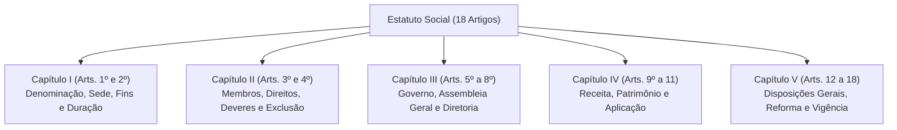

# [WDLC-F3] Especificação Técnica: Transcrição e Estruturação do Estatuto Social em Akoma Ntoso 3.0 XML

> **Identificador:** SPEC-WDLC-F3-ESTATUTO  
> **Status:** Aprovado e Implementado  
> **Referência GitHub:** [Issue #3](https://github.com/ibnp-guapo/website/issues/3)  
> **Fonte Primária Documental:** [`data/legal/Estatuto-IBN-da-Paz.pdf`](../../data/legal/Estatuto-IBN-da-Paz.pdf)  
> **Arquivo XML Gerado:** [`data/legal/estatuto-social.akn.xml`](../../data/legal/estatuto-social.akn.xml)  
> **Dependência:** [SPEC-WDLC-F1](01-arquitetura-informacao-requisitos.md) ([Issue #1](https://github.com/ibnp-guapo/website/issues/1)) e [SPEC-WDLC-F2](02-design-system-prototipagem.md) ([Issue #2](https://github.com/ibnp-guapo/website/issues/2))  
> **Organização:** [ibnp-guapo](https://github.com/ibnp-guapo) / [website](https://github.com/ibnp-guapo/website)  
> **Última Atualização:** 2026-09-10  

---

## 1. Visão Geral & Fonte Primária Notarial

Esta especificação técnica formaliza a transcrição integral e a modelagem semântica no padrão internacional **OASIS LegalDocML Akoma Ntoso 3.0** do Estatuto Social registrado da **Igreja Batista Nacional da Paz de Guapó** (IBN da Paz de Guapó / IBNP Guapó).

### 1.1 Metadados da Fonte Primária
- **Documento Oficial Original:** `data/legal/Estatuto-IBN-da-Paz.pdf`
- **Registro Notarial:** Averbado em **25 de Março de 2002** perante o **2º Serviço Notarial da Comarca de Guapó - Estado de Goiás** (Oficiala: Isabel Luiza das Dores Tobouti).
- **Entidade Registrada:** Igreja Batista Nacional da Paz de Guapó (CNPJ: `02.930.019/0001-62`, fundada em 14/01/1999).
- **Sede:** Rua Presidente Kennedy, Qd. 21, Lt. 13, Centro, Guapó - GO, CEP 75350-000.
- **Signatários Oficiais:** Pr. Waldir Custódio de Assis (Presidente / Pastor — ORMIBAN Goiás) e Deusimar Pereira Cabral (1ª Secretária).

---

## 2. Padrão Semântico Akoma Ntoso 3.0 (OASIS LegalDocML)

O documento foi gerado em estrita conformidade com a gramática semântica do Akoma Ntoso 3.0:
- **Namespace:** `xmlns="http://docs.oasis-open.org/legaldocml/ns/akn/3.0"`
- **Elemento Raiz:** `<akomaNtoso><act name="estatutoSocial">`

### 2.1 Metadados FRBR (`<meta>`)
O padrão FRBR (Functional Requirements for Bibliographic Records) foi implementado em três camadas:
1. **`<FRBRWork>`:**
   - URI: `/br/go/guapo/rel/estatuto/ibnp/2002-03-25`
   - Data de averbação notarial: `2002-03-25`
   - Autor: `#assembleiaGeral`
2. **`<FRBRExpression>`:**
   - URI: `/br/go/guapo/rel/estatuto/ibnp/2002-03-25/por@`
   - Idioma: Português (`por`)
3. **`<FRBRManifestation>`:**
   - URI: `/br/go/guapo/rel/estatuto/ibnp/2002-03-25/por@/main.akn.xml`
   - Formato MIME: `application/akn+xml`

### 2.2 Ontologia & Referências (`<references>`)
- `orig_1`: Documento original averbado `data/legal/Estatuto-IBN-da-Paz.pdf`.
- Organizações mapeadas: `#ibnp`, `#assembleiaGeral`, `#cbn`, `#cbnGo`, `#ormibanGo`.
- Pessoas signatárias: `#waldirCustodio` e `#deusimarPereira`.
- Localização oficial: `#guapo`.

---

## 3. Matriz Normativa dos 18 Artigos em 5 Capítulos

### Detalhamento por Capítulo:

| Capítulo | Artigos | eId | Conteúdo Principal e Dispositivos |
| :--- | :--- | :--- | :--- |
| **Capítulo I** | Art. 1º ao 2º | `cap_1` | Constituição da igreja, sede na Rua Presidente Kennedy em Guapó-GO, declaração doutrinária, filiação à Convenção Batista Nacional (CBN), autonomia local, e finalidades evangelísticas/sociais (§§ 1º ao 5º). |
| **Capítulo II** | Art. 3º ao 4º | `cap_2` | Admissão de membros por pedido verbal/escrito, direitos de voz e voto vinculados à condição de fiel dizimista e assiduidade, exclusão do rol sem restituição de valores, e restrições eleitorais a incapazes (art. 4º, § 1º, incisos 1 a 5). |
| **Capítulo III** | Art. 5º ao 8º | `cap_3` | Estrutura administrativa (Presidente via ORMIBAN Goiás, Assembleia Geral, Diretoria, Diaconia, Conselho). Assembleia Geral bimestral e extraordinária privativa (art. 6º, § 3º, incisos I a VII). Diretoria com 7 membros e mandato pastoral indeterminado. |
| **Capítulo IV** | Art. 9º ao 11 | `cap_4` | Fontes de receita (dízimos, ofertas e doações) e patrimônio institucional aplicado exclusivamente nas finalidades religiosas e sociais. |
| **Capítulo V** | Art. 12 ao 18 | `cap_5` | Não responsabilidade individual, cláusula pétrea de cisão (bens ao grupo fiel à CBN), destinação dos bens à CBN-GO em caso de dissolução (quórum de 3/4), quórum qualificado para reforma estatutária (2/3 de presença e maioria absoluta), e vigência a partir do registro em cartório em Guapó-GO. |

---

## 4. Validação & Integridade Semântica

O arquivo `data/legal/estatuto-social.akn.xml` foi testado e homologado pelo script [`scripts/validate_xml.py`](../../scripts/validate_xml.py):
- **Validação de Sintaxe XML:** 100% bem-formado sem erros de parsing.
- **Unicidade de Identificadores:** 76 atributos `eId` estritamente únicos (sem colisões).
- **Rastreabilidade:** Permalinks estruturados para consumo direto nas rotas do portal web (`/estatuto#art_1`, `/estatuto#art_8_par_1`, etc.).
